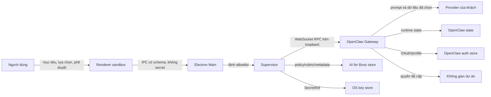
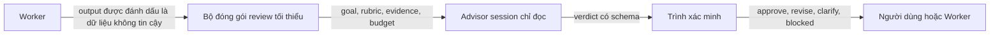
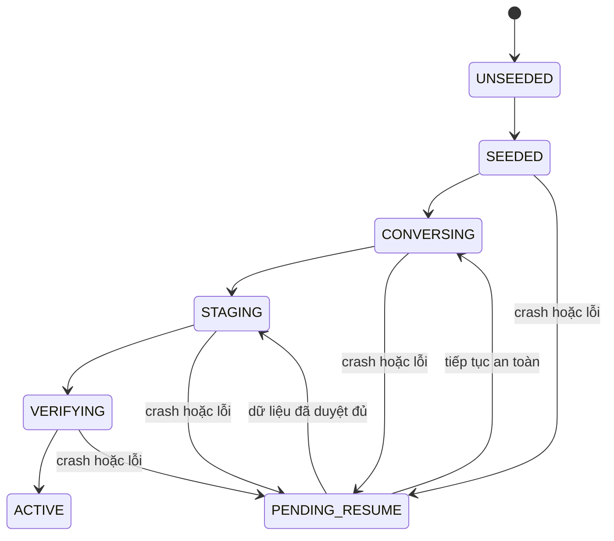
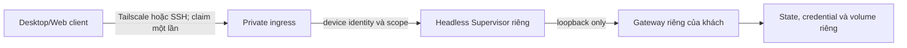

# Nguồn sự thật và luồng dữ liệu

Ngày khóa: 2026-08-11

Phạm vi: Feature 0.3, release train `oc-2026.7.1-2-locked.1`

## 1. Luật kiến trúc

Mỗi miền dữ liệu chỉ có một nguồn có quyền ghi chính. AI for Boss không đọc hoặc sửa trực tiếp SQLite, transcript, cache hay private state của OpenClaw. Dữ liệu hiển thị lấy từ Gateway RPC có thể cache, nhưng cache phải dựng lại được.

Nguồn máy đọc được nằm tại [source-of-truth.manifest.json](../../manifests/data/source-of-truth.manifest.json). Validator từ chối khi hai nguồn cùng tuyên bố quyền chính trên một miền dữ liệu.

## 2. Bản đồ nguồn sự thật

| ID | Nguồn | Phạm vi có quyền |
|---|---|---|
| SOT-01 | OpenClaw qua Gateway RPC/CLI/config/backup contract | Session, transcript, agent runtime, model status, usage, audit OpenClaw, schedule, channel, plugin và node runtime |
| SOT-02 | Kho dữ liệu AI for Boss có version | Policy sản phẩm, rubric Advisor, approval/audit metadata riêng, UI, pack, budget policy và project grant |
| SOT-03 | Kho bí mật hệ điều hành | Static provider/connector secret sau khi SecretRef contract test đạt |
| SOT-04 | OpenClaw native auth store | OAuth token, provider auth profile, channel credential và device token |
| SOT-05 | Agent Home riêng | Identity, persona, user profile, memory, heartbeat và bootstrap state của đúng một Agent |
| SOT-06 | Không gian dự án | File nguồn và artifact do người dùng sở hữu; quyền truy cập nằm ở SOT-02 |
| SOT-07 | Release train và manifest đã ký | Phiên bản, contract, artifact, signature và ma trận nền tảng |
| SOT-08 | Backup mã hóa | Artifact phục hồi, không phải live source |
| SOT-09 | Control plane tương lai | License, enrollment, signed enterprise policy và metadata được duyệt |

## 3. Luồng tổng thể trên desktop

Renderer được xem là vùng có thể bị khai thác. Nó chỉ nhận trạng thái sản phẩm, không giữ Gateway token, OAuth token, API key, raw port hoặc quyền quản trị thường trực.

## 4. Luồng Advisor

Advisor không có mutating tool, memory write, message send, exec hoặc browser action. Parse lỗi, hết ngân sách, thiếu evidence hoặc bị output worker thao túng giữ trạng thái `unreviewed`.

## 5. Luồng Agent Genesis

`BOOTSTRAP.md` tồn tại cho tới khi staging, validate, readback, identity sync và health check cùng đạt. `memory/` chưa được tạo trước trạng thái `ACTIVE`.

## 6. Luồng Always-on

Không có shared Gateway giữa các khách hàng đối kháng. Session ID không phải tenant boundary. HTTPS remote và remote browser tiếp tục bị chặn cho tới khi threat model, ingress audit, sandbox và pentest đạt.

## 7. Hành vi khi hỏng

- Không có silent fallback cho model, provider, auth mode, workspace, quyền hoặc tenant.
- Ghi dữ liệu thất bại giữ bản cũ và báo chưa lưu.
- Reconnect phải backfill history, in-flight run và approval backlog trước khi nhận mutation mới có nguy cơ trùng.
- Policy, approval hoặc identity không chắc chắn đều fail closed.
- Restore và update chỉ promote sau verify, migration và health check; lỗi quay về bản đang hoạt động.

## 8. Giới hạn bằng chứng

Các sơ đồ là hợp đồng kiến trúc cho feature tiếp theo. Chúng chưa chứng minh desktop shell, IPC, Credential Broker, sandbox, provider auth, backup hợp nhất hoặc Always-on đã được triển khai.
