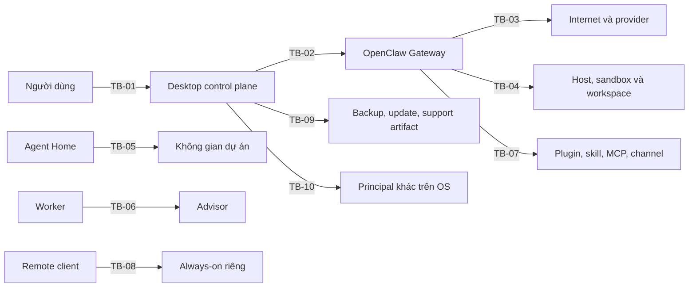

# Threat model AI for Boss

Ngày khóa: 2026-08-11

Phạm vi: Feature 0.3, release train `oc-2026.7.1-2-locked.1`

Phương pháp: STRIDE kết hợp abuse case dành cho AI Agent

## 1. Kết luận điều hành

AI for Boss xử lý OAuth, dữ liệu doanh nghiệp, file, browser, tool, tiến trình nền và remote instance. Đây là sản phẩm rủi ro loại C. Bản thiết kế giảm rủi ro bằng biên tin cậy, quyền tối thiểu, sandbox, approval, ký artifact, phục hồi và review độc lập. Chưa có cơ sở để tuyên bố sản phẩm an toàn hoặc sẵn sàng cho dữ liệu thật.

Các blocker nghiêm trọng nhất hiện nay:

1. Sandbox đa nền tảng chưa chứng minh.
2. Credential Broker/SecretRef chưa có contract test ba hệ điều hành.
3. Desktop shell, IPC và Supervisor chưa được triển khai.
4. Signing identity, updater và rollback production chưa tồn tại.
5. Provider OAuth chưa live-test bằng tài khoản chuyên dụng.
6. Advisor, policy, approval và agentic security suite chưa được triển khai.
7. Always-on mới khóa kiến trúc một instance riêng, chưa có remote claim hoặc pentest.

## 2. Biên tin cậy

Chi tiết máy đọc được nằm tại [threat-model.manifest.json](../../manifests/security/threat-model.manifest.json).

## 3. Abuse cases bắt buộc kiểm thử

| ID | Mối đe dọa | Cổng bằng chứng |
|---|---|---|
| T-01 | Artifact/dependency/update bị cấy hoặc downgrade | Feature 0.5 và Cổng 4 |
| T-02 | Gateway, Supervisor hoặc remote instance giả mạo | Cổng 1 và Cổng 4 |
| T-03 | Secret/OAuth/backup secret bị lộ | Feature 0.5, Cổng 1, 3, 4 |
| T-04 | OAuth callback/state/code bị tráo hoặc dùng lại | Feature 1.4 |
| T-05 | One-time claim, pairing hoặc scope upgrade bị chiếm | Headless Cổng 4 |
| T-06 | Prompt injection từ web, file, channel hoặc Agent khác | Cổng 3 |
| T-07 | Advisor bị thao túng hoặc biến lỗi thành pass | Feature 2.6 và Cổng 3 |
| T-08 | Renderer, IPC hoặc local process vượt quyền | Feature 0.4, 0.5 và Cổng 1 |
| T-09 | Model tự cấp quyền, tự duyệt hoặc hành động quá mức | Feature 2.7 và Cổng 3 |
| T-10 | Path traversal, symlink escape, file giả mạo hoặc archive bomb | Feature 0.6 và Cổng 3 |
| T-11 | Bootstrap, migration hoặc restore tạo trạng thái nửa vời | Feature 2.2, 2.5 và Cổng 4 |
| T-12 | Plugin, MCP, channel hoặc connector vượt contract | Cổng 3 |
| T-13 | Replay, concurrency hoặc vòng lặp gây mutation trùng/denial-of-wallet | Cổng 1 và 3 |
| T-14 | Cross-tenant hoặc shared boundary làm lộ dữ liệu khách | Headless Cổng 4 và Cổng 7 |

## 4. Luật fail closed

- Identity, scope, policy, approval, signature, hash, provider, model hoặc workspace không chắc chắn đều dừng hành động.
- Không fallback sang host exec khi sandbox vắng mặt.
- Không đổi provider, model, auth mode, workspace hoặc tenant âm thầm.
- Không coi parse lỗi, timeout, thiếu evidence hoặc Advisor hết ngân sách là pass.
- Không retry mutation khi chưa chứng minh idempotency và reconciled state.
- Không promote backup, migration hoặc update trước verify và health check.
- Không dùng prompt thay cho control cưỡng chế.

## 5. Ngoài phạm vi cam kết

Threat model không hứa bảo vệ tuyệt đối trước administrator/root đã chiếm máy, malware cùng hoặc cao quyền, thiết bị mở khóa bị lấy cắp, kernel/firmware bị xâm nhập, provider account bị chiếm bên ngoài AI for Boss hoặc người dùng cố ý duyệt một hành động nguy hiểm đã được mô tả rõ.

Sản phẩm vẫn phải giảm thiệt hại bằng quyền tối thiểu, ACL, mã hóa toàn đĩa được khuyến nghị, revoke, audit và incident playbook.

## 6. Điều kiện review

Mọi threat Critical hoặc High tiếp tục mở cho tới khi có control đã triển khai và bằng chứng adversarial/recovery ở đúng cổng. Trước pilot thật cần reviewer nền tảng senior và security reviewer độc lập. Trước beta công khai cần pentest độc lập, sửa toàn bộ phát hiện High/Critical và có người chịu trách nhiệm kỹ thuật bằng tên.
